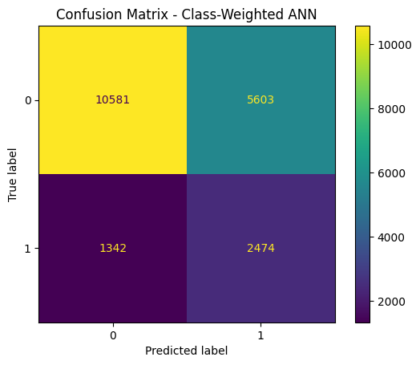

# Algorithmic Credit Risk Decision Support

An empirical Information Systems project examining how predictive-model design choices redistribute errors in a high-stakes lending context. Using historical LendingClub outcomes, the study compares neural-network, interpretable, and tree-based models and asks how class weighting and decision thresholds change the balance between missed defaults and additional human review.

The repository is framed as a study of **algorithmic decision support**, not as an automated underwriting product. Its central concern is how model performance, institutional objectives, and human oversight interact when the positive class is uncommon and prediction errors have unequal consequences.

## Research questions

1. How does class imbalance affect the apparent performance of credit-risk classifiers?
2. How do threshold tuning and class-weighted learning redistribute false negatives and false positives?
3. Does a more complex neural network provide a meaningful advantage over interpretable and tree-based benchmarks?
4. How should predictive outputs be incorporated into a human review process without treating them as causal or normatively neutral?

## Information Systems relevance

Credit assessment is a sociotechnical process: model outputs are interpreted within organizational policies, review procedures, and regulatory constraints. This project therefore treats accuracy as insufficient and evaluates the decision consequences of model selection. It connects machine learning with research on algorithmic decision-making, Human-Centered AI, model governance, and responsible analytics.

## Data and empirical design

- **Unit of analysis:** an individual LendingClub loan
- **Outcome:** fully paid versus charged off/default
- **Analytic sample:** 200,000 historical records
- **Validation design:** reproducible 80/10/10 train, validation, and test split
- **Models:** regularized ANN, Logistic Regression, and Random Forest
- **Pipeline choices:** decision-threshold tuning and class-weighted learning
- **Evaluation:** accuracy, recall, F1 score, ROC-AUC, and confusion matrices

These are predictive comparisons on observational data. They do not identify the causal effect of borrower characteristics, platform policies, or lending decisions on repayment.

## Results

| Model | Accuracy | Recall | F1 score | ROC-AUC |
|---|---:|---:|---:|---:|
| Regularized ANN (0.5 threshold) | 0.8103 | 0.0238 | 0.0458 | 0.7102 |
| Threshold-tuned ANN (0.3) | 0.7738 | 0.3548 | 0.3744 | 0.7102 |
| Class-weighted ANN | 0.6528 | 0.6483 | **0.4160** | 0.7084 |
| Logistic Regression | — | **0.6680** | 0.4131 | — |
| Random Forest | — | 0.6208 | 0.4156 | — |

The default 0.5 threshold produced high apparent accuracy but detected very few defaults. Threshold tuning improved recall, while class weighting produced the strongest ANN F1 score and substantially higher recall. The Logistic Regression and Random Forest benchmarks performed similarly on the reported metrics, so the evidence does not support a simple claim that model complexity dominates.

The class-weighted ANN is retained as the focal specification because it best matches the project objective among the ANN variants. In practice, the appropriate operating threshold would be a governance choice informed by review capacity, error costs, calibration, fairness analysis, and regulatory requirements—not a purely technical optimum.



## Decision-support interpretation

The notebook translates estimated default probability into risk bands and review flags. These outputs should be understood as prioritization aids for trained reviewers. They should not be used as an official credit score, a causal explanation of borrower behavior, or a substitute for due process and human judgment.

## Repository structure

```text
.
├── data/
│   └── README.md
├── docs/
│   └── model_governance_notes.md
├── figures/
├── notebooks/
│   └── credit_risk_modeling.ipynb
├── results/
│   └── model_metrics.csv
├── .gitignore
├── LICENSE
└── requirements.txt
```

## Reproducing the analysis

1. Create and activate a Python environment.
2. Install the dependencies:

   ```bash
   pip install -r requirements.txt
   ```

3. Follow the dataset instructions in `data/README.md`.
4. Open `notebooks/credit_risk_modeling.ipynb` and run the cells in order.

The notebook reads `data/lending_club_clean.feather` by default. You can instead set the `LENDINGCLUB_DATA` environment variable to an absolute path.

## Limitations and next steps

- The sample contains historical platform decisions and outcomes, so selection, measurement, and historical-policy bias may remain.
- A random split does not test performance under temporal drift; an out-of-time validation should precede deployment.
- Aggregate metrics cannot establish equitable performance across demographic groups, especially when protected-attribute coverage is unavailable.
- ROC-AUC measures ranking, not probability calibration or the institutional cost of a chosen threshold.
- Future work should add calibration analysis, subgroup audits where lawful and appropriate, explanation stability, drift monitoring, and structured human-review evaluation.

See [`docs/model_governance_notes.md`](docs/model_governance_notes.md) for the methodological and governance interpretation.

## Author

[yooyangr](https://github.com/yooyangr)

## License

The project code is released under the MIT License. The dataset is not redistributed and remains subject to its original terms.
